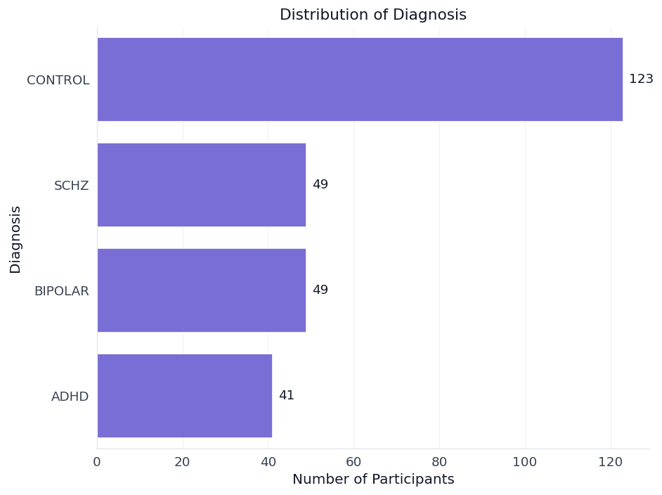
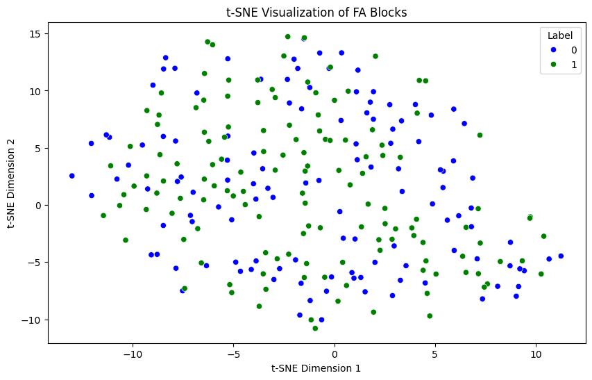
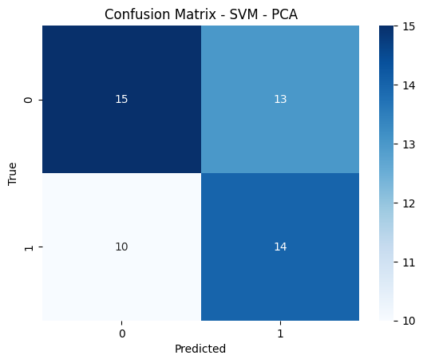
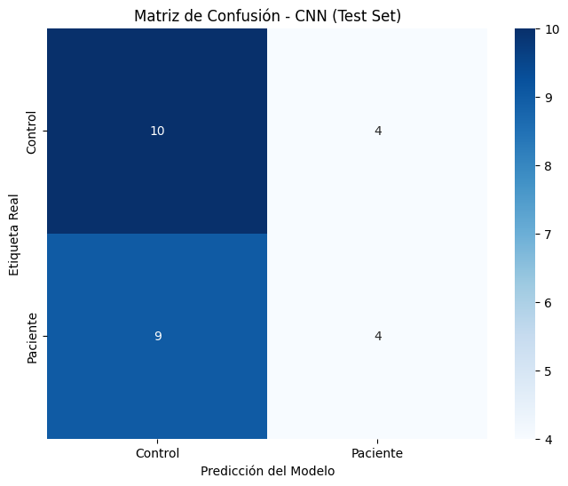
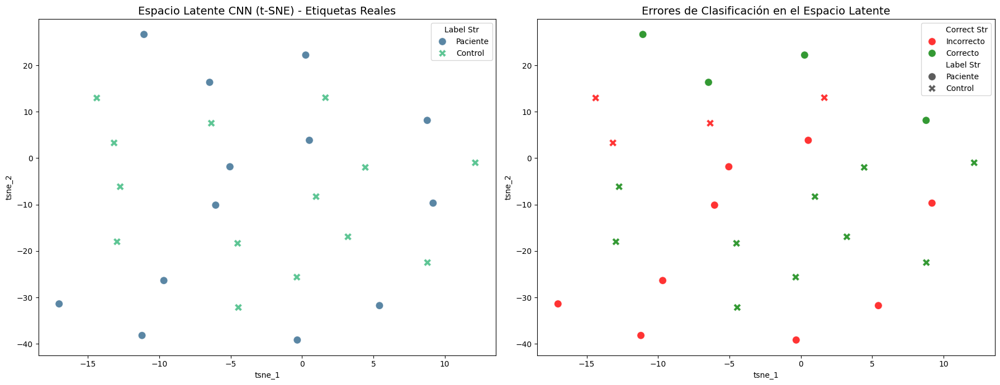
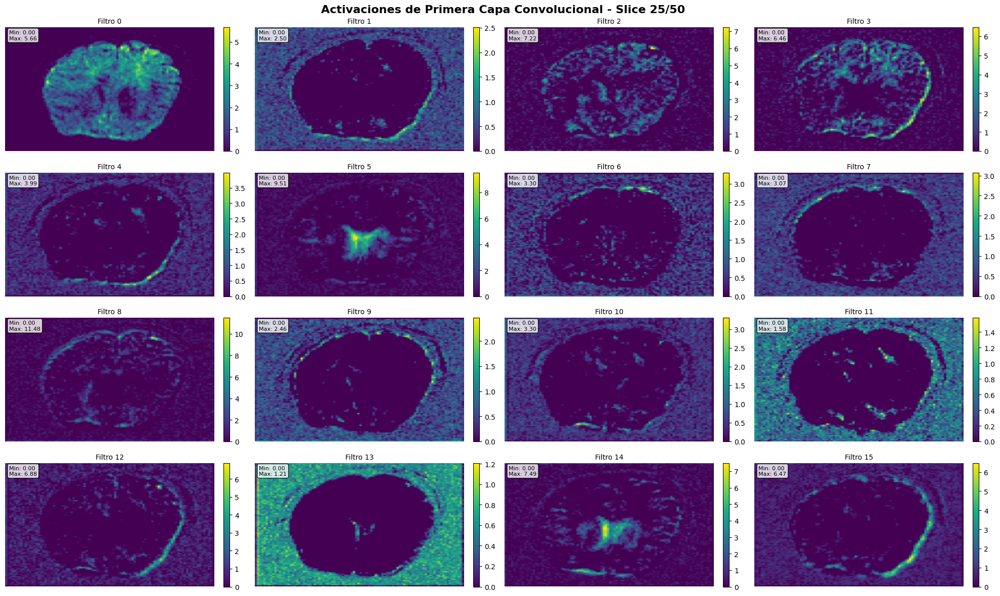
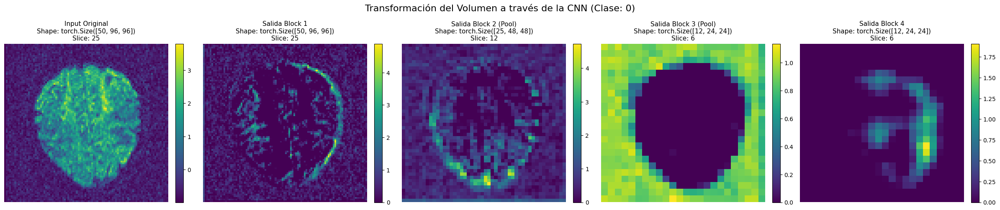

# 🧠 DWI Mining: Neuropsychiatric Disorder Classification

[](https://www.python.org/)
[](https://pytorch.org/)
[](LICENSE)

> **Machine Learning project for automated classification of neuropsychiatric disorders using Diffusion-Weighted Imaging (DWI) and deep learning techniques.**

---

## 📋 Table of Contents
- [Project Overview](#-project-overview)
- [Dataset](#-dataset)
- [Methodology](#-methodology)
- [Results](#-results)
- [Installation & Usage](#-installation--usage)
- [Project Structure](#-project-structure)
- [Authors](#-authors)

---

## 🎯 Project Overview

This project implements an **end-to-end machine learning pipeline** applying the **CRISP-DM methodology** to classify neuropsychiatric disorders using brain imaging data. We developed both traditional ML and deep learning approaches to identify structural biomarkers that distinguish healthy controls from patients with **schizophrenia, bipolar disorder, and ADHD**.

### Key Achievements:
- ✅ Processed and normalized **200+ DWI brain volumes** (96×96×50, 64 diffusion channels)
- ✅ Engineered **512 Fractional Anisotropy (FA) block features** from DTI tensor models
- ✅ Implemented custom **3D Convolutional Neural Network** achieving ~70% balanced accuracy
- ✅ Compared classical ML (SVM, XGBoost) vs deep learning approaches
- ✅ Visualized model activations and decision boundaries using t-SNE

---

## 📊 Dataset

**UCLA Consortium for Neuropsychiatric Phenomics LA5c Study**  
[OpenNeuro Dataset](https://openneuro.org/datasets/ds000030/versions/1.0.0)

### Dataset Characteristics:
- **272 participants** (262 preprocessed)
- **4 diagnostic groups**: Control, ADHD, Bipolar Disorder, Schizophrenia
- **Imaging modalities**: DWI, structural MRI, fMRI
- **Format**: NIfTI (Neuroimaging Informatics Technology Initiative)
- **Organization**: BIDS (Brain Imaging Data Structure) standard

<p align="center">
  
</p>

### Data Preprocessing:
- **Spatial normalization** to MNI template
- **Motion correction** for head movement artifacts
- **Noise filtering** using median_otsu brain extraction
- **Z-score normalization** per subject
- **Gradient direction handling** (64 diffusion directions + b0 volume)

---

## 🔬 Methodology

We followed the **CRISP-DM** (Cross-Industry Standard Process for Data Mining) framework:

### Phase 1: Business Understanding
- **Objective**: Develop automated classification models for early detection of neuropsychiatric disorders


### Phase 2: Data Understanding
- Analyzed DWI acquisition metadata (TR, TE, b-values, gradient directions)
- Explored class distribution (imbalanced: 130 controls vs 132 patients across 3 disorders)
- Validated data quality: 96×96×50 spatial dimensions, 65 volumes per subject



### Phase 3: Data Preparation

#### A) Feature Engineering Approach (Classical ML)
We implemented a novel **block-based FA extraction pipeline**:

1. **DTI Tensor Estimation**:
   - Fit diffusion tensor model using gradient table (bvals/bvecs)
   - Calculate **Fractional Anisotropy (FA)** at each voxel:
   
   $$FA = \sqrt{\frac{3}{2}} \frac{\sqrt{(\lambda_1 - \bar{\lambda})^2 + (\lambda_2 - \bar{\lambda})^2 + (\lambda_3 - \bar{\lambda})^2}}{\sqrt{\lambda_1^2 + \lambda_2^2 + \lambda_3^2}}$$

2. **Spatial Registration**: Re-sampled all FA volumes to common reference grid
3. **Block Aggregation**: Divided volumes into 8×8×8 grid (512 blocks), computed mean FA per block
4. **Result**: 512-dimensional feature vector per subject



#### B) Deep Learning Approach (3D CNN)
- Preserved full 4D volume structure (64 channels × 50 slices × 96 × 96)
- Removed b0 volume, used only diffusion-weighted channels
- Applied z-score normalization per subject
- Data split: 80% train / 10% validation / 10% test

### Phase 4: Modeling

#### Classical ML Models:
1. **Support Vector Machine (SVM)**:
   - Pipeline: StandardScaler → PCA (95% variance) → SVM(RBF kernel)
   - Hyperparameter tuning via GridSearchCV (C, gamma)
   - Best params: `C=10, gamma=0.01, kernel='rbf'`

2. **XGBoost**:
   - RandomizedSearchCV (50 iterations)
   - Pipeline: StandardScaler → PCA → XGBoost
   - Best params: `n_estimators=450, max_depth=5, learning_rate=0.238`

#### Deep Learning Model:
**Custom 3D CNN Architecture**:
```
Input (64, 50, 96, 96)
    ↓
Block 1: Conv3D(32 filters) + BatchNorm + ReLU + Dropout(0.1)
    ↓
Block 2: Conv3D(64) + BatchNorm + ReLU + MaxPool3D + Dropout(0.1)
    ↓
Block 3: Conv3D(128) + BatchNorm + ReLU + MaxPool3D + Dropout(0.1)
    ↓
Block 4: Conv3D(256) + BatchNorm + ReLU + Dropout(0.1)
    ↓
AdaptiveAvgPool3D(1) → Flatten → Linear(128) → Dropout(0.2) → Linear(2)
```

**Training Strategy**:
- Loss: CrossEntropyLoss
- Optimizer: Adam (lr=1e-4)
- Epochs: 150 with early stopping
- Selection: Best weighted accuracy (0.4×train + 0.6×val)
- Regularization: Dropout, BatchNorm, Weight Decay

### Phase 5: Evaluation

---

## 📈 Results

### Confusion Matrix - SVM 




### Confusion Matrix - Best Model (3D CNN)




### t-SNE Visualization of Learned Representations

The 3D CNN learned meaningful feature representations that separate controls from patients in latent space:




### Activation Visualizations

**Example: Correctly Classified Patient**


**Learned Features Across Network Depth**:


The network progressively extracts:
1. **Block 1**: Low-level edges and texture patterns
2. **Block 2-3**: Regional white matter tract structures
3. **Block 4**: Abstract discriminative features for classification

---

## 🚀 Installation & Usage

### Prerequisites
```bash
# Python 3.8+
pip install numpy pandas matplotlib seaborn
pip install torch torchvision
pip install nibabel dipy
pip install scikit-learn xgboost plotly
```

### Download Dataset
```bash
# Option 1: Manual download from OpenNeuro
# https://openneuro.org/datasets/ds000030/versions/1.0.0

# Option 2: Using Google Colab (recommended)
# Open scripts/data_download.ipynb in Colab
# Update BASE_PATH to your Google Drive location
# Run all cells
```

### Run Feature Extraction
```python
# Execute mineria_fase3.ipynb
# This generates dwi_block_features_for_svm.csv with 512 FA features
```

### Train Models
```python
# run mineria_fase4.ipynb
```

### Evaluate
```python
# Run mineria_fase5.ipynb for comprehensive evaluation
# Includes: confusion matrices, t-SNE, activation maps
```

---

## 📁 Project Structure

```
dwi_mining/
│
├── data/                       # Raw DWI data (BIDS format)
│   └── sub-###/
│       └── dwi/
│           ├── sub-###_dwi.nii.gz
│           ├── sub-###_dwi.bval
│           └── sub-###_dwi.bvec
│
├── scripts/
│   └── data_download.ipynb    # Google Colab data acquisition
│
├── mineria_fase2.ipynb        # Phase 2: Data Understanding
├── mineria_fase3.ipynb        # Phase 3: Data Preparation & Feature Engineering
├── mineria_fase4.ipynb        # Phase 4: Modeling (SVM, 3D CNN)
├── mineria_fase5.ipynb        # Phase 5: Evaluation & Visualization
│
├── out/
│   ├── svm_model.pkl          # Trained SVM
│   ├── best_v2_cnn.pth        # Best 3D CNN checkpoint
│   └── dwi_block_features_for_svm.csv  # Engineered features
│
├── README.md
└── LICENSE
```


## 🔮 Future Improvements

- [ ] Multi-modal fusion (combine DWI + fMRI + structural MRI)
- [ ] Transfer learning from pre-trained 3D models (MedicalNet, ResNet3D)
- [ ] Explainability: Grad-CAM for highlighting discriminative brain regions
- [ ] Multi-class classification (separate ADHD/Bipolar/Schizophrenia)
- [ ] Ensemble methods (SVM + CNN probabilistic fusion)

---

## 📚 References

1. Poldrack, R. A., et al. (2016). "The UCLA Consortium for Neuropsychiatric Phenomics LA5c Study." *OpenNeuro*. https://openneuro.org/datasets/ds000030
2. Basser, P. J., & Pierpaoli, C. (1996). "Microstructural and physiological features of tissues elucidated by quantitative-diffusion-tensor MRI." *Journal of Magnetic Resonance*, 111(3), 209-219.
3. He, K., et al. (2016). "Deep Residual Learning for Image Recognition." *CVPR*.

---

## 👥 Authors

**Aguilar Martínez Erick Yair**  
**Chagüén Hernández Daniel Isidoro**  
**Vera Garfias José Daniel**

*Data Mining Project - UNAM (Universidad Nacional Autónoma de México)*  
*Fall 2024*

---

## 📄 License

This project is licensed under the MIT License - see the [LICENSE](LICENSE) file for details.

---

<p align="center">
  <i>Leveraging AI and neuroimaging to advance mental health diagnostics 🧠💜</i>
</p> 
